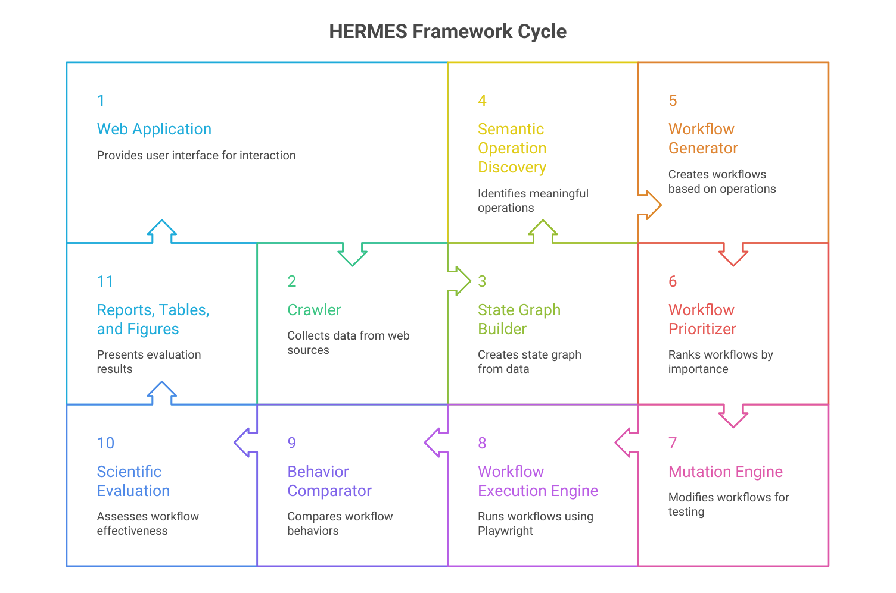

<div align="center">

# HERMES

### Hypothesis-driven Exploration through Reasoning for Modeling and Executing Semantic Workflows

**An Autonomous Stateful Web Workflow Fuzzing Framework**


</div>

---

# Overview

HERMES (**Hypothesis-driven Exploration through Reasoning for Modeling and Executing Semantic Workflows**) is an autonomous framework for **stateful web workflow fuzzing**.

Unlike conventional web fuzzers that primarily mutate HTTP requests, parameters, or payloads, HERMES discovers semantic workflows, constructs workflow state graphs, generates workflow-context mutations, executes mutated workflows automatically, and compares behavioral outcomes to identify state-dependent business logic anomalies.

Instead of treating individual requests as the fuzzing target, HERMES treats **the complete workflow** as the primary testing unit, enabling systematic exploration of business logic that depends on execution history.

---

# Project Statistics

| Metric | Value |
|---------|------:|
| Programming Language | Python 3.12+ |
| Framework | HERMES |
| Benchmark | HERMES-Bench |
| Workflow Executions | 370 |
| License | MIT |

---

# Motivation

Modern web applications maintain complex application state across multiple user interactions.

Examples include:

- User authentication
- Shopping carts
- Wallet balances
- Checkout workflows
- Order history
- Permission chains
- Session history

Traditional web fuzzers primarily mutate:

- HTTP requests
- Parameters
- URLs
- Input payloads

Although effective for input validation, these techniques frequently overlook faults that emerge only after specific workflow histories.

HERMES addresses this limitation by introducing **workflow-context mutation**, allowing systematic exploration of state-dependent business logic.

---

# Research Contributions

The framework provides:

- Automatic workflow discovery
- Stateful graph construction
- Semantic operation discovery
- Workflow generation
- Workflow prioritization
- Generic workflow mutation
- Hypothesis-driven workflow mutation
- Automated Playwright execution
- Behavioral comparison
- Scientific evaluation pipeline
- Reproducible experimentation

---

# Framework Architecture



HERMES follows a modular workflow fuzzing pipeline that automatically discovers application workflows, constructs workflow state graphs, generates workflow-context mutations, executes mutated workflows, and compares behavioral outcomes.

The framework consists of the following modules:

```text
Crawler
    │
    ▼
State Graph Builder
    │
    ▼
Semantic Operation Discovery
    │
    ▼
Workflow Generator
    │
    ▼
Workflow Prioritization
    │
    ▼
Workflow Mutation Engine
    │
    ▼
Execution Engine
    │
    ▼
Behavior Comparator
    │
    ▼
Scientific Evaluation
```

Each component is independently testable and designed to facilitate future research extensions.

---

# Repository Status

| Component | Status |
|-----------|--------|
| Framework | ✅ Complete |
| HERMES-Bench | ✅ Complete |
| Workflow Discovery | ✅ Complete |
| Mutation Engine | ✅ Complete |
| Execution Engine | ✅ Complete |
| Scientific Evaluation | ✅ Complete |
| Conference Research Artifact | ✅ Ready |

---

# Evaluation Summary

The current implementation has been evaluated using **HERMES-Bench**, a purpose-built benchmark for stateful workflow fuzzing.

The evaluation consists of baseline workflow execution, generic workflow mutations, and hypothesis-driven workflow mutations.

| Experiment | Executions |
|------------|-----------:|
| Baseline Workflows | 25 |
| Generic Workflow Mutations | 320 |
| Hypothesis-driven Workflow Mutations | 25 |
| **Total Workflow Executions** | **370** |

The framework automatically generates:

- JSON execution reports
- CSV result summaries
- Publication-ready LaTeX tables
- Publication-quality figures
- Statistical summaries
- Experimental logs

---

# Scientific Evaluation Pipeline


The evaluation pipeline automatically executes complete workflow experiments, compares behavioral outcomes between baseline and mutated executions, and generates reproducible research artifacts suitable for scientific evaluation.

---

# Repository Structure

```text
hermes-framework/
│
├── src/                    # Core framework implementation
├── tests/                  # Unit and integration tests
├── scripts/                # Utility scripts
├── evaluation/             # Experimental outputs
├── docs/
│   └── figures/            # Figures used in the paper and README
├── configs/                # Experiment configurations
├── requirements.txt
├── pyproject.toml
├── LICENSE
└── README.md
```

---

# Installation

Clone the repository.

```bash
git clone https://github.com/SDET-Hamad-KMughal/hermes-framework.git
cd hermes-framework
```

Create a virtual environment.

```bash
python -m venv venv
```

Activate the environment.

**Windows**

```bash
venv\Scripts\activate
```

**Linux / macOS**

```bash
source venv/bin/activate
```

Install the required dependencies.

```bash
pip install -r requirements.txt
```

Install Playwright browsers.

```bash
playwright install
```

Verify the installation.

```bash
pytest -q
```

All tests should complete successfully.

---

# Quick Start

Run the complete scientific evaluation.

```bash
python scripts/run_scientific_evaluation.py \
    --config evaluation/configs/experiment.json
```

The framework automatically performs:

1. Workflow discovery
2. State graph construction
3. Semantic operation discovery
4. Workflow generation
5. Workflow mutation
6. Automated execution
7. Behavioral comparison
8. Experimental evaluation

Generated outputs include:

- Raw execution reports
- JSON summaries
- CSV result tables
- LaTeX tables
- Publication-ready figures
- Experimental logs

All outputs are written automatically to the `evaluation/` directory.

---

# Output Directory

After execution, generated artifacts are organized as follows:

```text
evaluation/
│
├── reports/
├── figures/
├── tables/
├── logs/
└── summary.json
```

This directory contains all experimental outputs required to reproduce the reported evaluation.

---

# HERMES-Bench


HERMES is evaluated using **HERMES-Bench**, a benchmark specifically developed for stateful workflow fuzzing research.

Unlike traditional web testing benchmarks, HERMES-Bench models realistic business workflows with persistent application state, enabling controlled evaluation of workflow-context mutations.

Implemented functionality includes:

- User Registration
- User Authentication
- Product Catalog
- Shopping Cart
- Wallet Top-up
- Checkout
- Order History
- Administrative Dashboard

The benchmark also contains seeded business-logic anomalies for validating workflow mutation strategies.

---

# Benchmark Workflows

Representative workflows evaluated by HERMES include:

| Workflow | Description |
|----------|-------------|
| User Login | Authenticate a registered user |
| Browse Catalog | Explore available products |
| Add to Cart | Add products to the shopping cart |
| Wallet Top-up | Increase available account balance |
| Checkout | Complete the purchasing workflow |
| View Orders | Access historical purchases |
| Logout | Terminate the active session |

These workflows form the baseline for all workflow mutation experiments.

---

# Mutation Strategies

HERMES currently supports two complementary workflow mutation strategies.

## Generic Workflow Mutations

Generic mutations systematically explore alternative workflow executions through structural modifications.

Supported mutation operators include:

- Step insertion
- Step deletion
- Adjacent swap
- Non-adjacent swap
- Workflow reordering
- Prerequisite removal

---

## Hypothesis-driven Workflow Mutations

Hypothesis-driven mutations evaluate explicit business-logic assumptions by intentionally modifying workflow history.

Representative mutations include:

- Checkout without authentication
- Checkout with insufficient wallet balance
- Duplicate wallet top-up
- Unauthorized order history access
- Missing prerequisite operations
- Invalid workflow sequencing

Each mutated workflow is executed independently and compared with its corresponding baseline workflow.

---

# Reproducibility

HERMES emphasizes reproducible software engineering research.

Executing the evaluation pipeline automatically reproduces:

- Workflow execution reports
- JSON outputs
- CSV summaries
- Publication-ready LaTeX tables
- Publication-quality figures
- Experimental metrics

All reported experimental results are generated automatically by the framework.

---

# Citation

If you use HERMES in your research, please cite:

```bibtex
@misc{hermes2026,
  title={HERMES: Hypothesis-driven Exploration through Reasoning for Modeling and Executing Semantic Workflows},
  author={Hamad Sajad Mughal},
  year={2026},
  note={Conference Research Artifact}
}
```

This citation will be updated following the official conference publication.

---

# Future Work

Future research directions include:

- Evaluation on additional web applications
- New workflow mutation operators
- LLM-assisted semantic workflow reasoning
- Distributed workflow execution
- Cross-application workflow analysis
- Large-scale empirical evaluation

---

# License

This project is distributed under the **MIT License**.

See the `LICENSE` file for complete licensing information.

---

# Acknowledgements

HERMES was developed as part of ongoing research on autonomous software testing and stateful web workflow fuzzing.

The framework is intended to support future research in:

- Stateful Web Fuzzing
- Business Logic Testing
- Semantic Workflow Analysis
- Software Testing and Verification
- Web Security Evaluation

---

# Repository Status

| Component | Status |
|-----------|--------|
| Framework | ✅ Complete |
| HERMES-Bench | ✅ Complete |
| Workflow Discovery | ✅ Complete |
| Mutation Engine | ✅ Complete |
| Execution Engine | ✅ Complete |
| Scientific Evaluation | ✅ Complete |
| Conference Research Artifact | ✅ Ready |

---

<div align="center">

# HERMES

**Hypothesis-driven Exploration through Reasoning for Modeling and Executing Semantic Workflows**

### Advancing Stateful Web Workflow Fuzzing through Semantic Workflow Mutation

**Research Prototype • Reproducible Evaluation • Conference Research Artifact**

© 2026 Hammad Sajjad Mughal

</div>